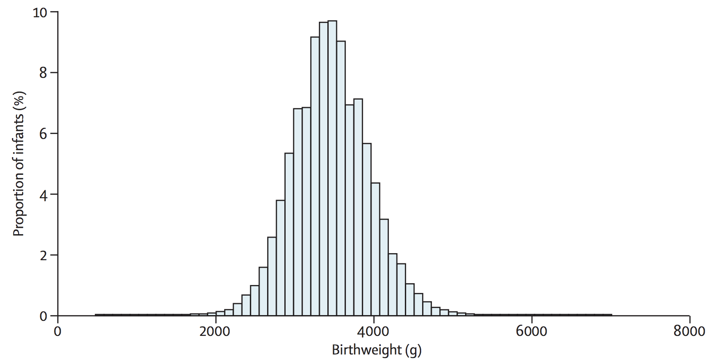
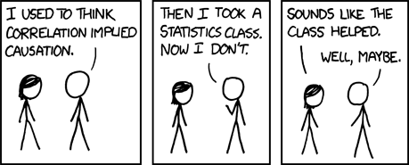
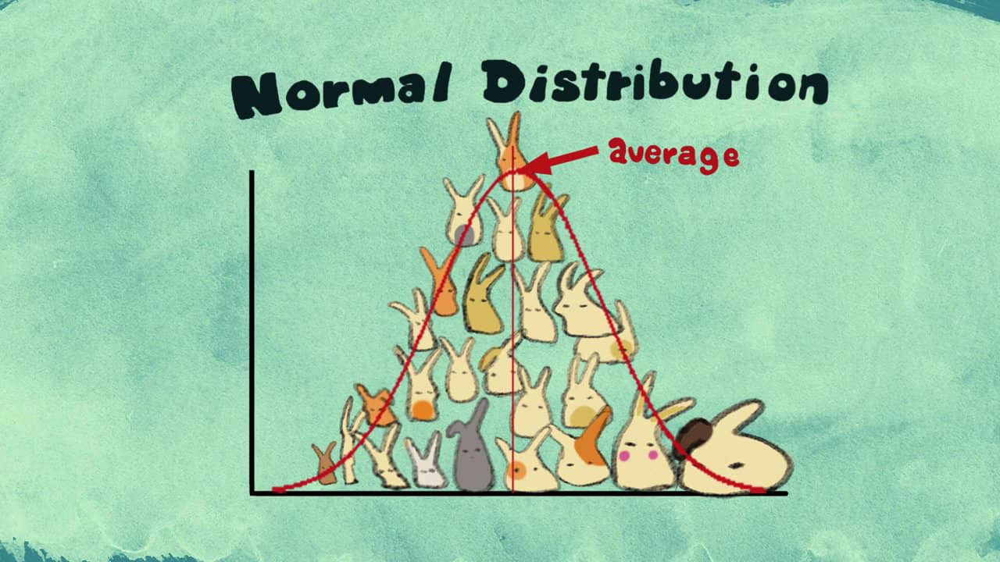
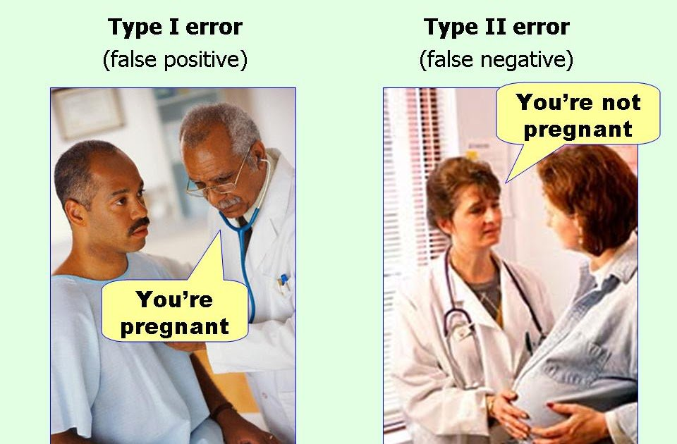
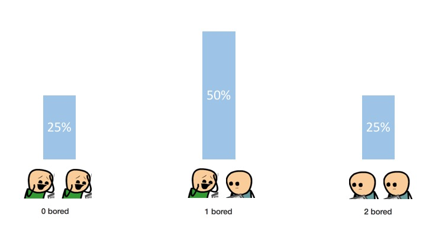
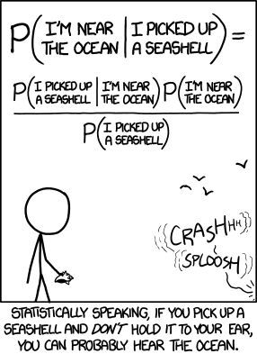

```{r setup, include=FALSE}

# load example data - https://wonder.cdc.gov/natality-current.html
raw.data <- read.delim("Natality-monthly-gender.txt")
birth.weight <- raw.data[,c("Month","Month.Code","Gender","Gender.Code","Births", "Average.Birth.Weight","Standard.Deviation.for.Average.Birth.Weight")]

big.cols <- c(rgb(31, 119, 180, maxColorValue=255),
              rgb(225, 46, 44, maxColorValue=255),
              rgb(23, 190, 207, maxColorValue=255),
              rgb(242, 174, 10, maxColorValue=255),
              rgb(44, 160, 44, maxColorValue=255))

```

<br> <br> <br> <br> <br> <br>

## Statistics is a way to identify patterns in the world that we aren't able to see on our own

We do this in the context of some question we are wondering about

<br> <br> <br> <br> <br> <br> <br> <br> <br> <br> <br> <br> <br> <br> <br> <br> <br>


## Example: Newborn birth weight


[Ludwig and Currie, 2010 The Lancet](https://www.thelancet.com/journals/lancet/article/PIIS0140-6736(10)60751-9/fulltext)

<br> <br> <br> <br> <br> <br> <br> <br>

Let's say I'm a doctor at a hospital and I've noticed that in the past month a few of my otherwise healthy patients have had very small babies. I get suspicious and went back through their records. The only thing I could find was that they were all taking a new brand of prenatal vitamins. How can I gather evidence to decide whether the vitamins might be the problem or its just a coincidence?

```{r hyptest, echo=FALSE, fig.width=13}
may.mean <- birth.weight[birth.weight$Month.Code==5,"Average.Birth.Weight"][3]
may.sd <- birth.weight[birth.weight$Month.Code==5,"Standard.Deviation.for.Average.Birth.Weight"][3]
may.samp <- rnorm(1000,may.mean,may.sd-10)

jan.mean <- birth.weight[birth.weight$Month.Code==1,"Average.Birth.Weight"][3]
jan.sd <- birth.weight[birth.weight$Month.Code==1,"Standard.Deviation.for.Average.Birth.Weight"][3]
jan.samp <- rnorm(10,jan.mean-500,jan.sd)

hist(may.samp,
     xlab="", ylab= "", main="",
     breaks = seq(0,8000,by=100),
     yaxt="n",
     col=big.cols[1], density=20, angle=180
     )
hist(jan.samp,
     xlab="", ylab= "", main="",
     breaks = seq(0,8000,by=100),
     yaxt="n",
     col=big.cols[5], density=100, add=TRUE
     )

```

<br> <br> <br> <br>

## Hypothesis testing

### 1. I make a hypothesis: 

Mothers taking this brand of vitamins also have smaller babies

<br> <br> <br> <br> <br> <br> <br> <br>



[xkcd](https://xkcd.com/552/)

<br> <br> <br> <br> <br> <br> <br> <br>


### 2. I think of the the opposite hypothesis that would be kind of boring: 

Mothers are just as likely to have small babies no matter what brand of vitamins they take

<br> <br> <br> <br> <br> <br> <br> <br>

### 3. I figure out what I can measure to **disprove** my null hypothesis

weight of each newborn

average weight of all newborns whose mothers took the vitamins

difference between the average weight of all newborns whose mothers took the vitamins and the average weight of all newborns whose mothers took other vitamins

<br> <br> <br> <br> <br> <br> <br> <br>

### 4. If I could repeat this experiment many many times and the null hypothesis is always true, what kind of results would I get?

Well if there is no real effect of the vitamins then the differences between the two groups will usually be zero. But just by chance maybe one group of babies has a few very large newborns or a few smaller newborns. So there will be random differences between any two groups you pick.

We know the differences between two groups (that are really from the same large population) will usually be zero (mean = 0) and there will be some variation due to random chance. We could expect that variation will get smaller if we take larger samples so any one large baby has less of an effect on the average.

#### This is called a null distribution!
The distribution of whatever you are measuring under the null hypothesis


<br> <br> <br> <br> <br> <br> <br> <br> <br> <br> <br> <br> <br> <br> <br> <br>

In this case, if the mean is zero and the variation gets smaller with larger sample size, then the distribution is a t distribution, similar to a Normal distribution.


[source](https://vimeo.com/75089338)

<br> <br> <br> <br> <br> <br>

```{r birthweighthist, echo=FALSE, fig.width=13}
dec.mean <- birth.weight[birth.weight$Month.Code==12,"Average.Birth.Weight"][3]
dec.sd <- birth.weight[birth.weight$Month.Code==12,"Standard.Deviation.for.Average.Birth.Weight"][3]
dec.x <- seq(round(dec.mean-4*dec.sd),round(dec.mean+4*dec.sd),by=1)
plot(dec.x,dnorm(dec.x,dec.mean,dec.sd),
     bty="l",
     xlab="", ylab= "", col=big.cols[2])

polygon(c(min(dec.x),dec.x,max(dec.x)),
        c(0,dnorm(dec.x,dec.mean,dec.sd),0), 
        col=big.cols[2], border=NA)

two.sd.bool <- (dec.x > round(dec.mean-2*dec.sd))&(dec.x < round(dec.mean+2*dec.sd))
dec.x.2 <- dec.x[two.sd.bool]
polygon(c(min(dec.x.2),dec.x.2,max(dec.x.2)),
        c(0,dnorm(dec.x.2,dec.mean,dec.sd),0), 
        col=big.cols[4], border=NA)

one.sd.bool <- (dec.x > round(dec.mean-dec.sd))&(dec.x < round(dec.mean+dec.sd))
dec.x.1 <- dec.x[one.sd.bool]
polygon(c(min(dec.x.1),dec.x.1,max(dec.x.1)),
        c(0,dnorm(dec.x.1,dec.mean,dec.sd),0), 
        col=big.cols[3], border=NA)

```

### About $\color{cyan}{\text{68% of the area}}$ includes the mean plus or minus 1 standard deviation 

### About $\color{orange}{\text{95% of the area}}$ includes the mean plus or minus 2 standard deviation 

<br> <br> <br> <br> <br> <br>

Back to the newborns ...

```{r ttest1, echo=FALSE, fig.width=13}
hist(may.samp,
     xlab="", ylab= "", main="",
     breaks = seq(0,8000,by=100),
     yaxt="n",
     col=big.cols[1], density=20, angle=180
     )
hist(jan.samp,
     xlab="", ylab= "", main="",
     breaks = seq(0,8000,by=100),
     yaxt="n",
     col=big.cols[5], density=100, add=TRUE
     )

```

We're measuring the differences between the averages of each group. If the null hypothesis were true, and we repeat this experiment over and over again, the difference between two groups will usually be zero, but sometimes just due to chance one sample will have larger babies than the other. 

```{r ttest2, echo=FALSE, fig.width=13}
tdist <- hist(rt(1000,9),
     xlab="", ylab= "", main="", yaxt="n", col="grey", density=100,
     breaks=20, freq=FALSE
     )
```

<br> <br> <br> <br> <br> <br> <br> <br> 

We can compare the actual difference we noticed in the hospital to the **null distribution** to ask:

#### What is the probability that the differences we see in real life are due to random chance not associated with the vitamins?

<br> <br> <br> <br> <br> <br> <br> <br>

```{r ttest3, echo=FALSE, fig.width=13}
t.value <- (mean(jan.samp) - mean(may.samp))/(sd(jan.samp)/sqrt(10))
dtbreaks <- seq(min(tdist$breaks),max(tdist$breaks),length.out=1000)
plot(dtbreaks,dt(dtbreaks,9),type="l",lwd=5,
     xlab="", ylab="",yaxt="n")
points(c(t.value,t.value),c(0,300),
       type="l",col=big.cols[5],lwd=5
       )

polygon(c(dtbreaks[1],dtbreaks[dtbreaks< t.value],max(dtbreaks[dtbreaks< t.value])),
        c(0,dt(dtbreaks[dtbreaks< t.value],9),0),
        col="darkgreen")
```

#### The $\color{green}{\text{green area of the curve}}$ is ...

#### the probability that a random sample of babies would have a lower average birthweight than our vitamin babies

### The chance of seeing a group of random babies who weighed less on average than our group is `r signif(dt(t.value,9),4)*100`%.


This value is our p-value: the probabilty that random chance could produce data as, or more, extreme than the observed data
  
Usually we use a cutoff of 5% for p-values: We say the data are not just a coincidence, or vitamin brand has a significant effect, if the probabilty that random chance could produce data as, or more, extreme than the observed data, is less than 5%. 

#### But significance levels (p=0.05) are arbitrary!!!

<br> <br> <br> <br> <br> <br> 


[xkcd](https://xkcd.com/539/)

<br> <br> <br> <br> <br> <br> <br> <br> <br> <br> <br> <br> 

## Hypothesis testing is the same for every test!!


#### 1. For any question, what is your hypothesis?

#### 2. For any hypothesis, what would be the null?

#### 3. For any hypothesis, what statistic could you measure to evaluate it?

#### 4. If you repeated this experiment many many times and the null were true, what would the histogram of statistics you measure look like?

#### 5. Ask how likely it is that random chance could produce data as, or more, extreme than the observed data

<br> <br> <br> <br> <br> <br> <br> <br> <br> <br> 


# Errors

```{r errors, echo=FALSE, fig.width=13}

plot(dtbreaks,dt(dtbreaks,9),type="l",lwd=5,
     xlab="", ylab="", bty="l")
polygon(c(dtbreaks[1], dtbreaks[dtbreaks<= qt(0.05,9)], 
          max(dtbreaks[dtbreaks<=qt(0.05,9)])),
        c(0,dt(dtbreaks[dtbreaks<= qt(0.05,9)],9),0),
        col="red")
points(c(qt(0.05,9),qt(0.05,9)), c(0,1), type="l", lwd=3, lty=2, col="red")
```

#### The $\color{red}{\text{red area of the curve}}$ are the groups of babies that just by chance hapen to have lowest average birth weight, compared to the rest of the population. 

If the newborns in your experiment just happened to be one of these groups you would mistakenly conclude that the vitamins may have an adverse effect, even though there is no difference. This would be a false positive. By setting our significance level to 0.05 we know that 5% of the time we conduct an experiment we will make this error. 

We could also make the opposite error: concluding that the vitamins are not associated with low birth weights, even though they are. To know how often we would make that mistake we would have to have some knowledge of the larger distribution of birth weights for mothers who took those vitamins.

<br> <br> <br> <br> <br> <br> <br> <br> <br> <br> <br> <br> 

[photo credit](https://twitter.com/phiktn)

<br> <br> <br> <br> <br> <br> <br> <br> 

```{r birthweightgender, echo=FALSE, fig.height=7}
boy.mean <- birth.weight[birth.weight$Month.Code==12,"Average.Birth.Weight"][2]
boy.sd <- birth.weight[birth.weight$Month.Code==12,"Standard.Deviation.for.Average.Birth.Weight"][2]

girl.mean <- birth.weight[birth.weight$Month.Code==12,"Average.Birth.Weight"][1]
girl.sd <- birth.weight[birth.weight$Month.Code==12,"Standard.Deviation.for.Average.Birth.Weight"][1]

par(mfrow=c(3,1),oma=c(0,1,0,1))
hist(rnorm(5435,girl.mean,girl.sd),
     xlab="", ylab= "", main= "Birth weight by gender for December 2017", breaks = seq(0,8000,by=100),
     freq=FALSE, yaxt="n",
     col = "lightpink", density=30, angle = 90
     )
axis(2,at=seq(0,6,by=2)/10000, labels=seq(0,6,by=2))
hist(rnorm(5729,boy.mean,boy.sd),
     xlab="", ylab= "", main= "", breaks = seq(0,8000,by=100),
     freq=FALSE, yaxt="n",
     col = "lightblue", density=20,
     add = TRUE
     )

girl.samp <- rnorm(5000,girl.mean-500,girl.sd)
boy.samp <- rnorm(5000,boy.mean+500,boy.sd)
thresh <- 3300
hist(girl.samp,
     xlab="", ylab= "", main= "", breaks = seq(0,8000,by=100),
     freq=FALSE,
     col = "lightpink", density=30, angle = 90
     )
hist(boy.samp,
     xlab="", ylab= "", main= "", breaks = seq(0,8000,by=100),
     freq=FALSE,
     col = "lightblue", density=20,
     add = TRUE
     )
points(c(thresh,thresh),c(0,8),type="l",lwd=3)

girl.hist <- hist(girl.samp,
     xlab="", ylab= "", main= "", breaks = seq(0,8000,by=100),
     freq=FALSE,
     col = "lightpink", density=30, angle = 90
     )
axis(2,at=seq(0,6,by=2)/10000, labels=seq(0,6,by=2))
boy.hist <- hist(boy.samp,
     xlab="", ylab= "", main= "", breaks = seq(0,8000,by=100),
     freq=FALSE,
     col = "lightblue", density=20,
     add = TRUE
     )

for (i in 2:sum(boy.hist$breaks <= thresh)){
  rect(boy.hist$breaks[boy.hist$breaks <= thresh][i-1],
     0,
     boy.hist$breaks[boy.hist$breaks <= thresh][i],
     boy.hist$density[boy.hist$breaks <= thresh][i-1],
     border=NA, col="navyblue")
}

for (i in 2:sum(girl.hist$breaks >= thresh)){
  rect(girl.hist$breaks[girl.hist$breaks >= thresh][i-1],
     0,
     girl.hist$breaks[girl.hist$breaks >= thresh][i],
     girl.hist$density[girl.hist$breaks >= thresh][i-1],
     border=NA, col="pink3")
}
points(c(thresh,thresh),c(0,8),type="l",lwd=3)
```

## Confidence Intervals

```{r confint1, echo=FALSE, fig.width=13}

hist(may.samp,
     xlab="", ylab= "", main="",
     breaks = seq(0,8000,by=100),
     yaxt="n",
     col=big.cols[1], density=20, angle=180
     )

```


#### What if we just want to estimate the average weight of a newborn?

Easy! It is `r signif(may.mean,6)`g. 

But we know that this mean is calculated using only the babies born in that hospital over a certain period of time. If you repeated the experiment in a different hospital or over a different time period you might get a slightly different answer to to random chance alone. So it is important to estimate the error around a mean (or any other statistic). 

<br> <br> <br> <br> <br> <br> <br>

So lets think about what the null distribution of means would look like. If you estimates the mean birth weight over and over, you end up with a distirbution of means with some variation where occasionally you get a group of babies that are on average slightly overweight or slightly underweight.

```{r confint2, echo=FALSE, fig.width=13}

plot(dec.x,dnorm(dec.x,dec.mean,dec.sd),
     bty="l",
     xlab="", ylab= "", col=big.cols[2])

polygon(c(min(dec.x),dec.x,max(dec.x)),
        c(0,dnorm(dec.x,dec.mean,dec.sd),0), 
        col=big.cols[2], border=NA)

polygon(c(min(dec.x.2),dec.x.2,max(dec.x.2)),
        c(0,dnorm(dec.x.2,dec.mean,dec.sd),0), 
        col=big.cols[4], border=NA)

polygon(c(min(dec.x.1),dec.x.1,max(dec.x.1)),
        c(0,dnorm(dec.x.1,dec.mean,dec.sd),0), 
        col=big.cols[3], border=NA)

```

We know that variation goes down with sample size. So we use our **null distribution** to find the range that will give us the $\color{orange}{\text{95%}}$ range. For a Normal distribution this is the mean plus or minus *about* 2 standard deviations. 

Once we sample a group of babies and estimate the average, we estimate the standard error and calculate the confidence interval.

### This $\color{orange}{\text{95%}}$ confidence interval (CI) represents a range, that if you did this experiment over and over, calculated the CI over and over, 95% of the time it would overlap the true population mean birth weight.

<br> <br> <br> <br> <br> <br> <br> <br> <br> <br> <br> <br>




## Binomial distribution

- Binary - either yes or no, heads or tails, bored or not

- Coin flip - 50% chance each person here is bored by statistics

- Weighted coin - unfair - not necessarily 50%

- For a repeated number of coin flips, how many are heads?

## Example: Newborn gender

```{r gender, echo=FALSE, fig.width=13}

raw.data <- read.delim("Natality-us-gender.txt")
birth.gender <- raw.data[(raw.data$State=="Pennsylvania"),c("Gender.Code","Births")]
sex.ratio <- sum(birth.gender[birth.gender$Gender.Code=="F","Births"])/(sum(birth.gender[birth.gender$Gender.Code=="M","Births"])+sum(birth.gender[birth.gender$Gender.Code=="M","Births"]))
monthly.births <- round(mean(birth.gender[birth.gender$Gender.Code=="M","Births"]+birth.gender[birth.gender$Gender.Code=="F","Births"]))

fem.hist <- hist(birth.gender[birth.gender$Gender.Code=="F","Births"],
     xlab="Birth weight (g)", ylab="Births", 
     main="Monthly births of females in Pennsylvania 2007-2017",
     col="lightpink", border="black", density=100, freq=FALSE
     )
#hist(rbinom(1000000,monthly.births, sex.ratio), add=TRUE, freq=FALSE, breaks=10)

```

## Linear regression

```{r birthweight, echo=FALSE}
monthly.birth.weight <- birth.weight[birth.weight$Gender.Code=="",]
monthly.birth.weight <- monthly.birth.weight[!is.na(monthly.birth.weight$Month.Code),]

par(oma=c(4,1,1,1),xpd=NA)
plot(monthly.birth.weight$Month.Code, monthly.birth.weight$Average.Birth.Weight,
     type="l",
     ylab = "Average birth weight (g)", xlab="", xaxt="n"
)
points(monthly.birth.weight$Month.Code, monthly.birth.weight$Average.Birth.Weight,
     pch=19)
axis(1,at=monthly.birth.weight$Month.Code, labels=FALSE)
for (i in 1:length(monthly.birth.weight$Month)){
  text(monthly.birth.weight$Month.Code[i],min(monthly.birth.weight$Average.Birth.Weight)-10,labels=as.character(monthly.birth.weight$Month[i]),srt=-45)
}

```

We'd like to draw a line on the graph that is the best approximation to the data.

```{r bwreg1, echo=FALSE, fig.height=7}
par(mfrow=c(3,1),oma=c(3,1,0,1),xpd=NA)
plot(monthly.birth.weight$Month.Code, monthly.birth.weight$Average.Birth.Weight,
     type="l",
     ylab = "Average birth weight (g)", xlab="", xaxt="n"
)
points(monthly.birth.weight$Month.Code, monthly.birth.weight$Average.Birth.Weight,
     pch=19)
axis(1,at=monthly.birth.weight$Month.Code, labels=FALSE)
for (i in 1:length(monthly.birth.weight$Month)){
  text(monthly.birth.weight$Month.Code[i],min(monthly.birth.weight$Average.Birth.Weight)-10,labels=as.character(monthly.birth.weight$Month[i]),srt=-45)
}
points(monthly.birth.weight$Month.Code,
       -3*monthly.birth.weight$Month.Code+3288,
       type="l",lwd=3,col="red")

plot(monthly.birth.weight$Month.Code, monthly.birth.weight$Average.Birth.Weight,
     type="l",
     ylab = "Average birth weight (g)", xlab="", xaxt="n"
)
points(monthly.birth.weight$Month.Code, monthly.birth.weight$Average.Birth.Weight,
     pch=19)
axis(1,at=monthly.birth.weight$Month.Code, labels=FALSE)
for (i in 1:length(monthly.birth.weight$Month)){
  text(monthly.birth.weight$Month.Code[i],min(monthly.birth.weight$Average.Birth.Weight)-10,labels=as.character(monthly.birth.weight$Month[i]),srt=-45)
}
points(monthly.birth.weight$Month.Code,
       rep(3258,length(monthly.birth.weight$Month.Code)),
       type="l",lwd=3,col="red")

plot(monthly.birth.weight$Month.Code, monthly.birth.weight$Average.Birth.Weight,
     type="l",
     ylab = "Average birth weight (g)", xlab="", xaxt="n"
)
points(monthly.birth.weight$Month.Code, monthly.birth.weight$Average.Birth.Weight,
     pch=19)
axis(1,at=monthly.birth.weight$Month.Code, labels=FALSE)
for (i in 1:length(monthly.birth.weight$Month)){
  text(monthly.birth.weight$Month.Code[i],min(monthly.birth.weight$Average.Birth.Weight)-10,labels=as.character(monthly.birth.weight$Month[i]),srt=-45)
}

bw.lm <- lm(Average.Birth.Weight ~ as.numeric(Month.Code), data=monthly.birth.weight)
points(monthly.birth.weight$Month.Code,
       bw.lm$fitted.values,
       type="l",lwd=3,col="red")
```

## How can we decide if this is a real relationship or a coincidence? Hypothesis testing!

<br> <br>

#### 1. For any question, what is your hypothesis?

That newborn birth weight changes over the year

<br> <br>

#### 2. For any hypothesis, what would be the null?

Newborn birth weight is on average the same no matter what month it is

<br> <br>

#### 3. For any hypothesis, what statistic could you measure to evaluate it?

Change in birth weight over time

Slope of the regression line

<br> <br>

#### 4. If you repeated this experiment many many times and the null were true, what would the histogram of statistics you measure look like?

It would usually be zero, but might by chance be slightly positive or slightly negative.

The more babies you measure the less variation in slope

<br> <br>

#### 5. Ask how likely it is that random chance could produce data as, or more, extreme than the observed data


```{r lm, echo=FALSE}
summary(bw.lm)

t.value <- summary(bw.lm)$coefficients[2,3]
dtbreaks <- seq(-4,4,length.out=1000)
plot(dtbreaks,dt(dtbreaks,10),type="l",lwd=5,
     xlab="", ylab="",yaxt="n")
points(c(t.value,t.value),c(0,300),
       type="l",col="black",lwd=5
       )

polygon(c(min(dtbreaks[dtbreaks > t.value]),
          dtbreaks[dtbreaks > t.value],
          max(dtbreaks[dtbreaks > t.value])),
        c(0,dt(dtbreaks[dtbreaks > t.value],10),0),
        col="red")

polygon(c(min(dtbreaks[dtbreaks < -t.value]),
          dtbreaks[dtbreaks < -t.value],
          max(dtbreaks[dtbreaks < -t.value])),
        c(0,dt(dtbreaks[dtbreaks < -t.value],10),0),
        col="red")
```


<br> <br> <br> <br> <br> <br> 


# Bayesian analysis

Frequentists would say:

I could do an experiment of picking up random items and measuring the distance to the ocean and calculate the average distance to the ocean and repeat that experiment many many times. If its true that seashells are just as likely to be found near the ocean as any random item, then 

The proportion of times I did that experiment with something other than a seashell and ended up closer to the ocean than I did with the seashell is the probability I'm near the ocean, given that I picked up a seashell.

Bayesian statistics don't live in a universe where you need to think of hypothetically repeating experiments many many times.



[source](https://twitter.com/seanjtaylor/status/1073632404286275584)

